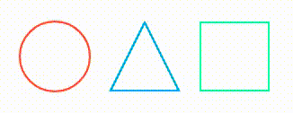

# "Progress Bar" And "Width / Height" In JavaScript By Amur

| Key                 | Type               | Value                               |
| ------------------- | :----------------: | ----------------------------------: |
| type                | String             | "circle" or "triangle" or "cubic"   |
| text                | Boolean            | true or false                       |
| fontColor           | String             | exp "#000000"                       |
| fontSize            | Number             | exp 17                              |
| fontWeight          | String or Number   | exp "bold" or 700                   |
| fillParent          | String             | exp "#00AAFF"                       |
| fillChild           | String             | exp "#00AAFF"                       |
| interval            | Number             | exp 1000                            |
| animated            | Boolean            | true or false                       |
| strokeWidthParent   | Number             | exp 3                               |
| strokeWidthChild    | Number             | exp 5                               |
| progressColor       | String             | exp "#00AAFF"                       |
| progressParentColor | String             | exp "#00AAFF"                       |

| Title               | link                                                                                         |
| ------------------- | -------------------------------------------------------------------------------------------- |
| Circle              | [Create Progress Bar With Circle In JavaScript](documentation/progressbarcircle.md)          |
| Triangle            | [Create Progress Bar With Triangle In JavaScript](documentation/progressbartriangle.md)      |
| Cubic               | [Create Progress Bar With Cubic In JavaScript](documentation/progressbarcubic.md)            |
| Opportunities       | [Other Opportunities In JavaScript](documentation/otheropportunities.md)                     |
| SVG Circle And Path | [Create SVG Circle With Circle Or With Path And Triangle With Path](documentation/circle.md) |
