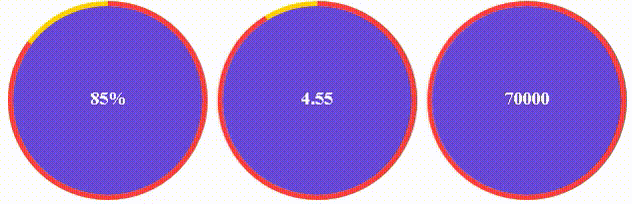
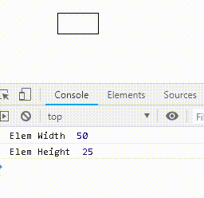

# Progress Bar And Widt / Height In JavaScript By Amur

## Example

## Get started

### html

	

	

	

	
	
	<!-- or -->
	

### JavaScript

	let Circle1 = document.getElementsByClassName('circle-1');
	let Circle2 = document.getElementsByClassName('circle-2');
	let Circle3 = document.getElementsByClassName('circle-3');

	let options = {
	    fontColor: '#FFFFFF',
	    fontSize: 18,
	    fontWeight: 900,
	    fillParent: '#6949D7',
	    fillChild: 'transparent',
	    interval: 1000,
	    animated: true,
	    strokeWidthParent: 5,
	    strokeWidthChild: 5,
	    progressColor: '#FE3F44',
	    progressParentCircleColor: '#FFD200'
	};

	new Progress(Circle1, options).inPercent();
	new Progress(Circle2, options).inCount(5);
	new Progress(Circle3, options).inCounter();
	
### JavaScript default options

	{
        fontColor: '#000000',
        fontSize: 16,
        fontWeight: 400,
        fillParent: 'none',
        fillChild: 'none',
        interval: 1000,
        animated: false,
        strokeWidthParent: 3,
        strokeWidthChild: 5,
        progressColor: '#00AAFF',
        progressParentCircleColor: '#E0E0E0',
	}

## Other Opportunities:

## Example

### html

	

### css

	.other{
	    width: 50px;
	    height: 25px;
	    border: 1px solid #000000;
	    -webkit-transition: all 300ms linear;
	    -moz-transition: all 300ms linear;
	    -ms-transition: all 300ms linear;
	    -o-transition: all 300ms linear;
	    transition: all 300ms linear;
	}

### javascript

	let elem = document.getElementsByClassName('other')[0];
	let parameters = new GeterSeterParameters(elem);
	parameters.Width; // return width
	parameters.Width = 100;
	// or
	parameters.Width = "100px";
	parameters.Height; // return height
	parameters.Height = 75;
	// or
	parameters.Height = "75px";
