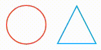

# "Progress Bar" And "Width / Height" In JavaScript By Amur

<table border="1">
    <thead>
        <tr>
            <th style="padding: 3px;" align="center">Key</th>
            <th style="padding: 3px;" align="center">Type</th>
            <th style="padding: 3px;" align="center">Value</th>
        </tr>
    </thead>
    <tbody>
        <tr>
            <td style="padding: 3px;" align="center">type</td>
            <td style="padding: 3px;" align="center">String</td>
            <td style="padding: 3px;" align="center">"circle" or "triangle"</td>
        </tr>
        <tr>
            <td style="padding: 3px;" align="center">text</td>
            <td style="padding: 3px;" align="center">Boolean</td>
            <td style="padding: 3px;" align="center">true or false</td>
        </tr>
        <tr>
            <td style="padding: 3px;" align="center">fontColor</td>
            <td style="padding: 3px;" align="center">String</td>
            <td style="padding: 3px;" align="center">exp "#000000"</td>
        </tr>
        <tr>
            <td style="padding: 3px;" align="center">fontSize</td>
            <td style="padding: 3px;" align="center">Number</td>
            <td style="padding: 3px;" align="center">exp 17</td>
        </tr>
        <tr>
            <td style="padding: 3px;" align="center">fontWeight</td>
            <td style="padding: 3px;" align="center">String or Number</td>
            <td style="padding: 3px;" align="center">exp "bold" or 700</td>
        </tr>
        <tr>
            <td style="padding: 3px;" align="center">fillParent</td>
            <td style="padding: 3px;" align="center">String</td>
            <td style="padding: 3px;" align="center">exp "#00AAFF"</td>
        </tr>
        <tr>
            <td style="padding: 3px;" align="center">fillChild</td>
            <td style="padding: 3px;" align="center">String</td>
            <td style="padding: 3px;" align="center">exp "#00AAFF"</td>
        </tr>
        <tr>
            <td style="padding: 3px;" align="center">interval</td>
            <td style="padding: 3px;" align="center">Number</td>
            <td style="padding: 3px;" align="center">exp 1000</td>
        </tr>
        <tr>
            <td style="padding: 3px;" align="center">animated</td>
            <td style="padding: 3px;" align="center">Boolean</td>
            <td style="padding: 3px;" align="center">true or false</td>
        </tr>
        <tr>
            <td style="padding: 3px;" align="center">strokeWidthParent</td>
            <td style="padding: 3px;" align="center">Number</td>
            <td style="padding: 3px;" align="center">exp 3</td>
        </tr>
        <tr>
            <td style="padding: 3px;" align="center">strokeWidthChild</td>
            <td style="padding: 3px;" align="center">Number</td>
            <td style="padding: 3px;" align="center">exp 5</td>
        </tr>
        <tr>
            <td style="padding: 3px;" align="center">progressColor</td>
            <td style="padding: 3px;" align="center">String</td>
            <td style="padding: 3px;" align="center">exp "#00AAFF"</td>
        </tr>
        <tr>
            <td style="padding: 3px;" align="center">progressParentColor</td>
            <td style="padding: 3px;" align="center">String</td>
            <td style="padding: 3px;" align="center">exp "#00AAFF"</td>
        </tr>
    </tbody>
</table>

<table border="1">
    <thead>
        <tr>
            <th style="padding: 3px;" align="center">Title</th>
            <th style="padding: 3px;" align="center">link</th>
        </tr>
    </thead>
    <tbody>
        <tr>
        	<td style="padding: 3px;" align="center">Circle</td>
            <td style="padding: 3px;" align="center">
                <a href="documentation/progressbarcircle.md">Create Progress Bar With Circle In JavaScript</a>
            </td>
        </tr>
        <tr>
        	<td style="padding: 3px;" align="center">Triangle</td>
        	<td style="padding: 3px;" align="center">
                <a href="documentation/progressbartriangle.md">Create Progress Bar With Triangle In JavaScript</a>
            </td>
        </tr>
        <tr>
        	<td style="padding: 3px;" align="center">Opportunities</td>
        	<td style="padding: 3px;" align="center">
                <a href="documentation/otheropportunities.md">Other Opportunities In JavaScript</a>
            </td>
        </tr>
        <tr>
        	<td style="padding: 3px;" align="center">SVG Circle And Path</td>
        	<td style="padding: 3px;" align="center">
                <a href="documentation/circle.md">Create SVG Circle With Circle Or With Path And Triangle With Path</a>
            </td>
        </tr>
    </tbody>
</table>