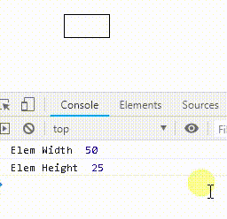

## Other Opportunities:

## Example

### html

	

### css

	.other{
	    width: 50px;
	    height: 25px;
	    border: 1px solid #000000;
	    -webkit-transition: all 300ms linear;
	    -moz-transition: all 300ms linear;
	    -ms-transition: all 300ms linear;
	    -o-transition: all 300ms linear;
	    transition: all 300ms linear;
	}

### javascript

	let elem = document.getElementsByClassName('other')[0];
	let parameters = new GeterSeterParameters(elem);
	parameters.Width; // return width
	parameters.Width = 100;
	// or
	parameters.Width = "100px";
	parameters.Height; // return height
	parameters.Height = 75;
	// or
	parameters.Height = "75px";

## If only you need other actions

	
	<!-- or -->
	
	