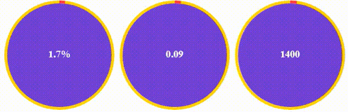

## Example

### JavaScript

	let Circle1 = document.getElementsByClassName('circle-1');
	let Circle2 = document.getElementsByClassName('circle-2');
	let Circle3 = document.getElementsByClassName('circle-3');

	let options = {
		type: 'circle',
	    fontColor: '#FFFFFF',
	    fontSize: 18,
	    fontWeight: 900,
	    fillParent: '#6949D7',
	    fillChild: 'transparent',
	    interval: 1000,
	    animated: true,
	    strokeWidthParent: 5,
	    strokeWidthChild: 5,
	    progressColor: '#FE3F44',
	    progressParentColor: '#FFD200'
	};

	new Progress(Circle1, options).inPercent();
	new Progress(Circle2, options).inCount(5);
	new Progress(Circle3, options).inCounter();
	