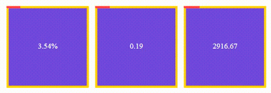

## Example

## Get started

### html

	

	

	

	
	
	<!-- or -->
	

### JavaScript default options

	{
		type: 'circle',
		text: true,
        fontColor: '#000000',
        fontSize: 16,
        fontWeight: 400,
        fillParent: 'none',
        fillChild: 'none',
        interval: 1000,
        animated: false,
        strokeWidthParent: 3,
        strokeWidthChild: 5,
        progressColor: '#00AAFF',
        progressParentColor: '#E0E0E0',
	}

### JavaScript

	let Cubic1 = document.getElementsByClassName('cubic-1');
	let Cubic2 = document.getElementsByClassName('cubic-2');
	let Cubic3 = document.getElementsByClassName('cubic-3');

	let options = {
		type: 'cubic',
		text: true,
	    fontColor: '#FFFFFF',
	    fontSize: 18,
	    fontWeight: 900,
	    fillParent: '#6949D7',
	    fillChild: 'transparent',
	    interval: 1000,
	    animated: true,
	    strokeWidthParent: 5,
	    strokeWidthChild: 5,
	    progressColor: '#FE3F44',
	    progressParentColor: '#FFD200'
	};

	new Progress(Cubic1, options).inPercent();
	new Progress(Cubic2, options).inCount(5);
	new Progress(Cubic3, options).inCounter();
	