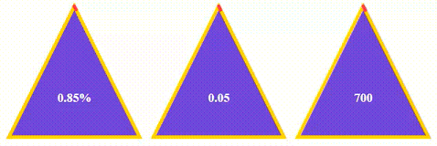

## Example

### JavaScript

	let Triangle1 = document.getElementsByClassName('triangle-1');
	let Triangle2 = document.getElementsByClassName('triangle-2');
	let Triangle3 = document.getElementsByClassName('triangle-3');

	let options = {
		type: 'triangle',
	    fontColor: '#FFFFFF',
	    fontSize: 18,
	    fontWeight: 900,
	    fillParent: '#6949D7',
	    fillChild: 'transparent',
	    interval: 1000,
	    animated: true,
	    strokeWidthParent: 5,
	    strokeWidthChild: 5,
	    progressColor: '#FE3F44',
	    progressParentColor: '#FFD200'
	};

	new Progress(Triangle1, options).inPercent();
	new Progress(Triangle2, options).inCount(5);
	new Progress(Triangle3, options).inCounter();
	